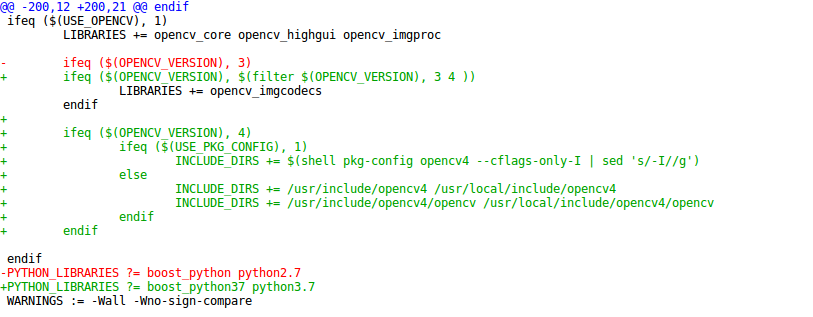
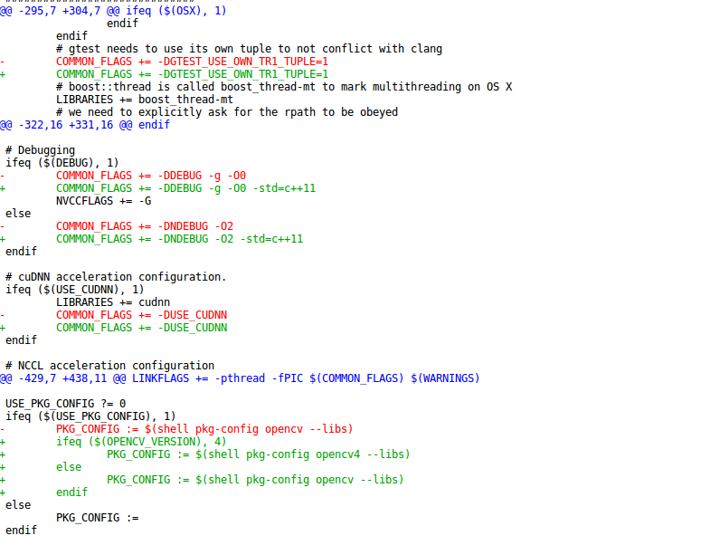
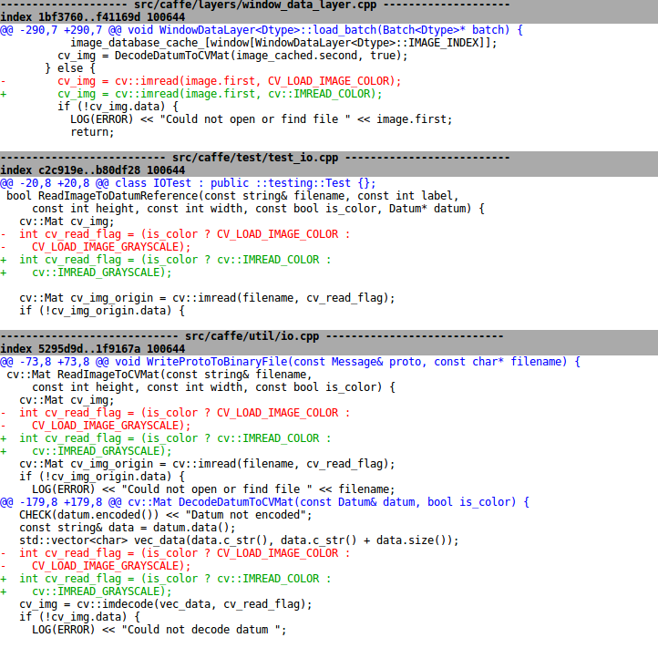

# Opencv - Caffe - DLIB Ubuntu install how-to.

This tutorial provides some hints on how to install Opencv/Caffe/Dlib on Ubuntu (tested on 16.04) with emphasis on compilation, Debian package creation and python usage.

Usually after compiling these libraries, installation is performed using *make --install* command. This choice of installation creates 2 drawbacks:

- uninstalling may be troublesome.
- creation of your own distributable libraries is difficult.

## Contents
1. [Assumptions](README.md#1-Assumptions)

2. [OpenCV and Contrib Modules](README.md#2-install-opencv-and-contrib-modules)

3. [Caffe](README.md#3-Caffe)

4. [DLIB](README.md#4-DLIB)

    

## 1. Assumptions
Before installing anything, update package information is important.

    sudo apt-get update
    sudo apt-get upgrade


## CUDA

In case it is intended to use CUDA, then it will be necessary do install NVIDIA drivers. This tutorial used *version 440*. After installing graphics card driver, installation of the following libraries shall be done:

- CUDA driver available from the [official nvidia website here](https://developer.nvidia.com/cuda-downloads?target_os=Linux).
- cuDNN available from website [official cuDNN website](https://developer.nvidia.com/cudnn).


## BOOST

Both Caffe and Dlib require boost to be installed on the system. This tutorial used *version 1.72.0*. After [downloading Boost](https://www.boost.org/users/history/version_1_72_0.html) . Place source code in a directory of your choice and then compile and install Boost according with [Boost easy installation](https://www.boost.org/doc/libs/1_72_0/more/getting_started/unix-variants.html#easy-build-and-install), summarized below:


    ./bootstrap.sh --with-python-version=3.7 --with-libraries=all --prefix=/usr/local
    
    sudo ./b2 install 


Note: make sure to use python version installed in your machine. This tutorial is based on *version 3.7*.

## 2. Install OpenCV and Contrib Modules
First, we will install the dependencies required for our build to work. Other libraries may be necessary, depending on the options you set on cmake.

     sudo apt-get install build-essential cmake git unzip pkg-config
     sudo apt-get install libjpeg-dev libpng-dev libtiff-dev
     sudo apt-get install libavcodec-dev libavformat-dev libswscale-dev
     sudo apt-get install libgstreamer1.0-dev libgstreamer-plugins-base1.0-dev
     sudo apt-get install libfaac-dev libmp3lame-dev libtheora-dev
     sudo apt-get install libavresample-dev libvorbis-dev
     sudo apt-get install libopencore-amrnb-dev libopencore-amrwb-dev
     sudo apt-get install libgtk2.0-dev libcanberra-gtk*
     sudo apt-get install x264 libxvidcore-dev libx264-dev libgtk-3-dev
     sudo apt-get install libtbb2 libtbb-dev libdc1394-22-dev
     sudo apt-get install libv4l-dev v4l-utils
     cd /usr/include/linux
     sudo ln -s -f ../libv4l1-videodev.h videodev.h
     cd ~
     sudo apt-get install libxine2-dev
     sudo apt-get install software-properties-common
     sudo add-apt-repository "deb http://security.ubuntu.com/ubuntu xenial-security main"
     sudo apt-get update
     sudo apt-get install libjasper-dev
     sudo apt-get install libopenblas-dev libatlas-base-dev libblas-dev
     sudo apt-get install liblapack-dev gfortran
     sudo apt-get install libhdf5-dev protobuf-compiler
     sudo apt-get install libprotobuf-dev libgoogle-glog-dev libgflags-dev

#### NOTE:  version of OpenCV. 4.2.0 is used here

Clone OpenCV (or download it to a folder of your preference)

    git clone https://github.com/opencv/opencv.git
    cd opencv
    cd ..

Clone (or download) OpenCV-contrib 4.2.0:

    git clone https://github.com/opencv/opencv_contrib.git
    cd opencv_contrib
    cd ..

Some aspects to note:

- inform cmake to build debian binary  package (CPACK_BINARY_DEB) .
- correctly inform python version and directory to be used (3.7).
- better to manually indicate where cuda toolkit is installed.
- make sure to inform where openc_contrib is located.
- indicate where installation files will be placed. In our case it will be a local directory.

Configure and generate the MakeFile in */opencv/build* folder:

    cd opencv
    mkdir build
    mkdir install
    cd build
    
    cmake -D CMAKE_VERBOSE_MAKEFILE=0N \
        -D CMAKE_BUILD_TYPE=RELEASE \
        -D CMAKE_INSTALL_PREFIX='$HOME'/opencv/install \
        -D CPACK_BINARY_DEB=ON \
        -D OPENCV_EXTRA_MODULES_PATH='$HOME'/opencv_contrib/modules \
        -D BUILD_TIFF=ON \
        -D WITH_FFMPEG=ON \
        -D WITH_GSTREAMER=ON \
        -D WITH_TBB=ON \
        -D BUILD_TBB=ON \
        -D WITH_EIGEN=ON \
        -D WITH_V4L=ON \
        -D WITH_LIBV4L=ON \
        -D WITH_VTK=OFF \
        -D WITH_OPENGL=OFF \
        -D OPENCV_ENABLE_NONFREE=ON \
        -D INSTALL_C_EXAMPLES=OFF \
        -D INSTALL_PYTHON_EXAMPLES=OFF \
        -D BUILD_NEW_PYTHON_SUPPORT=ON \
        -D OPENCV_GENERATE_PKGCONFIG=ON \
        -D BUILD_TESTS=OFF \
        -D BUILD_EXAMPLES=OFF \
        -D WITH_CUDA=ON \
        -D CUDA_TOOLKIT_ROOT_DIR=/usr/local/cuda-10.2 \
        -D ENABLE_FAST_MATH=ON \
        -D CUDA_FAST_MATH=ON \
        -D WITH_CUBLAS=ON \
        -D PYTHON3_EXECUTABLE=/usr/bin/python3.7 ..


Compile and install:

    make -j$(nproc-1)
    make install
    make package
    ls -1 *.deb

Check that *OpenCV-4.2.0-\*.deb* files  are listed.

Install each of one *dev,licenses,main,python and scripts*  packages:
`sudo dpkg -i OpenCV-4.2.0*.deb`

Check Installation:

```
dpkg --get-selections | grep opencv
opencv-dev             install
opencv-libs            install
opencv-licenses        install
opencv-main            install
opencv-python          install
opencv-scripts         install
```

Check python installation

    python3.7
    >>> import cv2
    >>> cv2.__version__
    '4.2.0'

To uninstall OpenCV:

    sudo dpkg -r opencv-*.deb


## 3. Caffe

Clone (or download) Caffe:

    git clone https://github.com/BVLC/caffe
    cd caffe


Edit *Makefile.config* (copy from *Mafefile.config.example*) according with the libraries installed in the system, that is, opencv4, CUDA 10.2 and python3.7

```
USE_CUDNN := 1
OPENCV_VERSION := 4
CUDA_DIR := /usr/local/cuda-10.2

CUDA_ARCH := -gencode arch=compute_30,code=sm_30 \
		-gencode arch=compute_35,code=sm_35 \
		-gencode arch=compute_50,code=sm_50 \
		-gencode arch=compute_52,code=sm_52 \
		-gencode arch=compute_60,code=sm_60 \
		-gencode arch=compute_61,code=sm_61 \
		-gencode arch=compute_61,code=compute_61
		
BLAS := open

PYTHON_LIBRARIES := boost_python37 python3.7m
PYTHON_INCLUDE := /usr/include/python3.7m \
                /usr/lib/python3.7/dist-packages/numpy/core/include
 
 WITH_PYTHON_LAYER := 1
 
INCLUDE_DIRS := $(PYTHON_INCLUDE) /usr/local/include /usr/include/hdf5/serial
LIBRARY_DIRS := $(PYTHON_LIB) /usr/local/lib /usr/lib /usr/lib/x86_64-linux-gnu/hdf5/serial/

# indicate build and distribution dir
BUILD_DIR := build
DISTRIBUTE_DIR := distribute

```


Some hacks on caffe source code are required in order do build with Opencv4 as indicated in pull request [#6625](https://github.com/BVLC/caffe/pull/6625/commits/7f503bd9a19758a173064e299ab9d4cac65ed60f) and related [discussion](https://github.com/BVLC/caffe/pull/6625) and replicated below:


**include support to opencv4 in makefile**




**still in the makefile, also add flag indicating support to c+=11**



**fix errors on code**



Once above corrections are made, caffe is ready to be compiled. It is advisable to run tests to check everything is fine.

```
make clean
make all -j$(nproc-1)
make test -j$(nproc-1)
make runtest -j$(nproc-1)

#after that compile for python
make pycaffe

#compile cafe distribution
make distribute
```


In order to construct the debian package, it is necessary to create installation directory structure and also write a debian package *control* file.

```
mkdir packageroot
mkdir -p packageroot/DEBIAN
nano packageroot/DEBIAN/CONTROL

# an example of control file
Package: caffe
Version: 1.0.0
Architecture: all
Maintainer: Your Name <your.name@your.mail.com>
Description: Custom Caffe Package

mkdir -p packageroot/usr/local
```


Once directory structure is created copy `bin lib include`  dirs located in *distribute* directory to `packageroot/usr/local`

then build and install debian package: 

```
dpkg-deb -b packageroot caffe_all.deb
sudo dpkg -i caffe_all.deb

# caffe does not include a package builder for python so it has to be included manually
sudo cp -r distribute/python/caffe /usr/local/lib/python3.7/dist-packages

#or else include caffe in PYTHONPATH
export PYTHONPATH="${PYTHONPATH}:/my/path_to/caffe/distribute/python/caffe
```


## 4. DLIB

DLIB is, in fact, a C++ library for image processing and machine learning, but it does have a python API and some important Convolutional Neural Networks ready to be deployed with good results and can be used together with openCV. Let's use the latest version 19.19:

```
git clone https://github.com/davisking/dlib
cd dlib
mkdir build
mkdir install
```


Just remember, that we are interested in making it work with CUDA 10.2 (adapt CUDA path according with your system). Passing a flag to NVCC is also required, so as the compilation can proceed without error.

Since it is intended to create a debian package, it will be configured to install dlib in a local directory

Configure and generate the MakeFile in */opencv/build* folder:


```
cd build

cmake  -D CMAKE_INSTALL_PREFIX=$HOME/dlib/install \
       -D DLIB_USE_CUDA=1 \
       -D USE_AVX_INSTRUCTIONS=1 \
       -D USE_SSE2_INSTRUCTIONS=1 \
       -D USE_SSE_INSTRUCTIONS=1 \
       -D CUDA_TOOLKIT_ROOT_DIR=/usr/local/cuda-10.2 \
       -D CUDA_NVCC_FLAGS="--expt-relaxed-constexpr" ..
       
make -j$(nproc-1)
make install
```


In order to construct the debian package, it is necessary to create installation directory structure and also write a debian package *control* file.

```
cd ..
mkdir packageroot
mkdir -p packageroot/DEBIAN
nano packageroot/DEBIAN/CONTROL

# an example of control file
Package: DLIB
Version: 19.19
Architecture: all
Maintainer: Your Name <your.name@your.mail.com>
Description: Custom DLIB Package

mkdir -p packageroot/usr/local
```


Once directory structure is created copy `lib include`  directories located in `install` directory to `packageroot/usr/local`

then build and install debian package: 

```
dpkg-deb -b packageroot dlib.deb
sudo dpkg -i dlib.deb
```

Once package is installed, proceed with python installation. The good thing is that the library does have a setup file, which allows to distribute a wheel package, as show below:

```
python3.7 setup.py bdist_wheel --set DLIB_USE_CUDA=1 \
                               --set USE_AVX_INSTRUCTIONS=1 \
                               --set CUDA_NVCC_FLAGS="--expt-relaxed-constexpr"

#if it is desired to make a system installation. bdist_wheel creates a dist directory \
#under dlib.

sudo pip3.7 install dist/dlib-19.19.99-cp37-cp37m-linux_x86_64.whl
```

